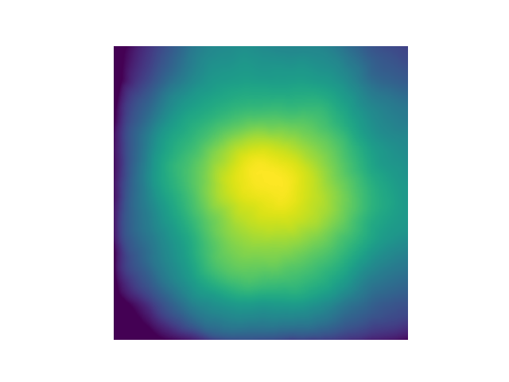
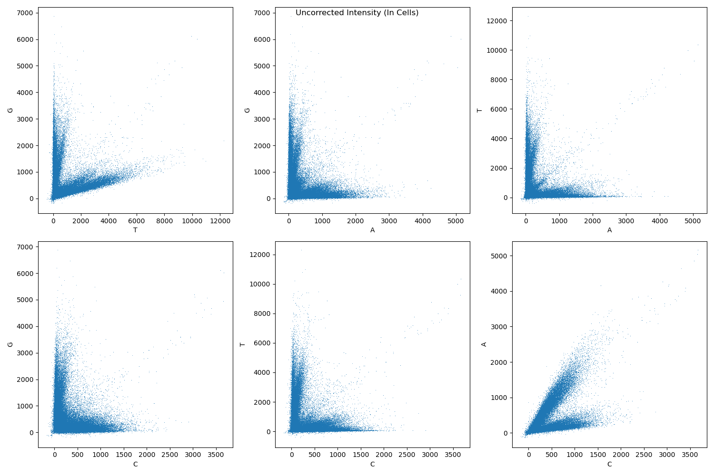
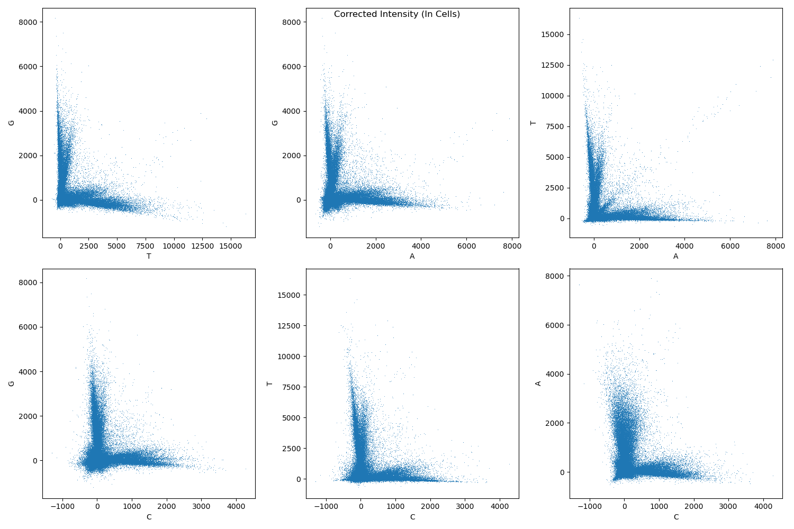

*********************
Command Line Examples
*********************

Example Data
============
MCF7 cells at 24 hours.

Data Location: "s3://xxx-input/"

FISH Channels: DAPI, ESR1, CCND1, GREB1

IF Channels: DAPI, ER, ConA

* ISS Image Pattern: "20231010_10x_6W_SBS_c{t}/plate{plate}/Well{well}_Point{skip}_{skip}_Channel{skip}_Seq{skip}.nd2"
* FISH & IF Image Pattern: "{skip}_20x_6W_{t}/plate{plate}/Well{well}_Point{skip}_{skip}_Channel{skip}_Seq{skip}.nd2"

.. list-table::
   :widths: 50 50 50
   :header-rows: 0

   * - DMSO
     -
     - ARV-471 100nM
   * - DMSO
     -
     - ARV-471 100nM

Illumination Correction
========================
Illumination correction is computed separately for each well, cycle, and channel using all image tiles as
input. It is calculated by computing the mean (or median; see --agg-method option), followed by a median filter
(radius of the disk-shaped footprint is 1/20th area of image), and rescaling using 2nd percentile for a robust
minimum in the aggregation method. This method is equivalent to CellProfiler's CorrectIlluminationCalculate_
module with option "Regular", "All", "Median Filter". The algorithm was originally benchmarked using ~250 images per
plate to calculate plate-wise illumination correction functions `(Singh et al. J Microscopy, 2014)`_.

Example flat-field image:

Example::

   # illumination correction per cycle in well 3 of ISS data
   scallops illum-corr agg \
   --agg-method mean \
   --images "s3://xxx-input/" \
   --image-pattern "20231010_10x_6W_SBS_c{t}/plate{plate}/Well{well}_Point{skip}_{skip}_Channel{skip}_Seq{skip}.nd2" \
   --output "s3://xxx/stitch/iss/illumination_correction/" \
   --groupby plate well t \
   --subset "A-3-*"

   # illumination correction per cycle in well 3 of immunofluorescence & FISH data
   scallops illum-corr agg \
   --agg-method mean \
   --images "s3://xxx-input/" \
   --image-pattern"{skip}_20x_6W_{t}/plate{plate}/Well{well}_Point{skip}_{skip}_Channel{skip}_Seq{skip}.nd2" \
   --output "s3://xxx/stitch/pheno/illumination_correction/" \
   --groupby plate well t \
   --subset "A-3-IF" "A-3-FISH"

Stitch
=======

Each well and cycle is stitched independently into an OME Zarr image. The stage positions are read directly from a
large number of file formats (including nd2). Illumination correction is applied by dividing the image intensity by the
flatfield image when writing the stitched image.

Example::

   scallops stitch \
   --images "s3://xxx-input/"\
   --image-pattern "s3://xxx-input/" \
   --ffp "s3://xxx/stitch/iss/illumination_correction/{plate}-{well}-{t}.ome.tiff" \
   --output "s3://xxx/stitch/iss/stitch/" \
   --groupby plate well t \
   --subset "A-3-*"

   scallops stitch \
   --images "s3://your_bucket/your_screen/subdirectory/20231012_20x_6W_IF/plateA/" \
   --image-pattern "Well{well}_Point{skip}_{skip}_Channel{skip}_Seq{skip}.nd2" \
   --ffp "s3://xxx/stitch/pheno/illumination_correction/{plate}-{well}-{t}.ome.tiff" \
   --output "s3://xxx/stitch/pheno/stitch/"  \
   --groupby plate well t \
   --subset "A-3-IF" "A-3-FISH"

Register ISS Images
=====================

Register ISS images to first cycle.

Example::

    scallops registration elastix \
    --groupby plate well \
    --moving-image-pattern '{plate}-{well}-{t}' \
    --moving-output s3://xxx/ops/iss-registered-t0.zarr \
    --moving s3://xxx/stitch/iss/stitch/stitch.zarr/ \
    --transform-output s3://xxx/ops/iss-transforms-t0 \
    --subset A-3

Register Phenotype Images
=========================

Create a single image stack registered to the IF DAPI channel. The `unroll-channels`
option stacks all the phenotypic channels into the c dimension of the resulting image. The `time` option
selects the reference round to align to. Note that the order of cycles is preserved (FISH, IF), hence
the registered image has the FISH channels followed by the IF channels.

Example::

    scallops registration elastix -\
    -groupby plate well \
    --moving-image-pattern '{plate}-{well}-{t}' \
    --moving-output s3://xxx/ops/pheno-registered.zarr \
    --moving s3://xxx/stitch/pheno/stitch/stitch.zarr/ \
    --moving-label s3://xxx/stitch/pheno/stitch/stitch.zarr/ \
    --transform-output s3://xxx/ops/pheno-to-pheno-transforms \
    --subset A-3 \
    --label-output s3://xxx/ops/pheno-registered.zarr \
    --unroll-channels \
    --time IF

Segmentation
============

Segment the phenotype images. Note that there is a one-to-one correspondence between nuclei and cell labels when using
the watershed or propagation algorithms for cell segmentation. Cytosol labels are computed by
taking the difference between cell and nuclei labels.

Nuclei::

    scallops segment nuclei \
    --images s3://xxx/ops/pheno-registered.zarr \
    --groupby plate well \
    --image-pattern '{plate}-{well}' \
    --dapi-channel 4
    --output s3://xxx/ops/segment.zarr \
    --subset A-3

Cells::

    scallops segment cell \
    --images s3://xxx/ops/pheno-registered.zarr \
    --groupby plate well \
    --image-pattern '{plate}-{well}' \
    --cyto-channel 6 \
    --nuclei-label s3://xxx/ops/segment.zarr \
    --output s3://xxx/ops/segment.zarr \
    --subset A-3

Register Phenotype to ISS & Transfer Segmentation Labels
========================================================

Register the phenotype image to the ISS image and transfer the segmentation labels
from phenotype image coordinates to ISS coordinates. Also output the registered phenotype DAPI channel, which will be
used later for QC.

Example::

    scallops registration elastix \
    --groupby plate well \
    --moving-image-pattern '{plate}-{well}' \
    --moving-output s3://xxx/ops/pheno-to-iss-registered.zarr \
    --moving s3://xxx/ops/pheno-registered.zarr \
    --moving-label s3://xxx/ops/segment.zarr \
    --fixed s3://xxx/stitch/iss/stitch/stitch.zarr/ \
    --fixed-image-pattern '{plate}-{well}-{t}' \
    --transform-output s3://xxx/ops/pheno-to-iss-transforms \
    --subset A-3 \
    --label-output s3://xxx/ops/pheno-to-iss-registered.zarr \
    --output-aligned-channels-only

Spot Detection
===============

Find spots by taking standard deviation over cycles, followed by mean across channels or if only 1 cycle is
present, computing standard deviation across channels.

Example::

    scallops pooled-sbs spot-detect \
    --output s3://xxx/ops/spot-detect.zarr \
    --image-pattern '{plate}-{well}' \
    --images s3://xxx/ops/iss-registered-t0.zarr \
    --channel 1 2 3 4 \
    --groupby plate well \
    --subset A-3

Read calling
============
Assign bases at each cycle to the base with maximum intensity after correcting for channel crosstalk.

Example crosstalk before correction:

Example crosstalk after correction:

Example::

    scallops pooled-sbs reads \
    --spots s3://xxx/ops/spot-detect.zarr \
    --labels s3://xxx/ops/pheno-to-iss-registered.zarr \
    --label-name cell \
    --output s3://xxx/ops/reads \
    --subset A-3 \
    --barcodes s3://bigdipir-ctg-s3/internal/singa166-lab/barcodes/dialout-5.csv

Find objects
==================
Find objects in a labeled array (output from segmentation).

Nuclei::

    scallops find-objects \
    --labels s3://xxx/ops/segment.zarr \
    --subset A-3 \
    --label-pattern {plate}-{well} \
    --label-suffix nuclei \
    --output s3://xxx/ops/objects-nuclei

Cells::

    scallops find-objects \
    --labels s3://xxx/ops/segment.zarr \
    --subset A-3 \
    --label-pattern {plate}-{well} \
    --label-suffix cell \
    --output s3://xxx/ops/objects-cell\

Cytosol::

    scallops find-objects \
    --labels s3://xxx/ops/segment.zarr \
    --subset A-3 \
    --label-pattern {plate}-{well} \
    --label-suffix cytosol \
    --output s3://xxx/ops/objects-cytosol

Pheno to ISS Registration QC
==============================
Compute correlation in nuclei bounding boxes between ISS DAPI channel and registered IF DAPI channel::

    scallops features \
    --features-nuclei correlationpearsonbox_0_s4 \
    --labels s3://xxx/ops/pheno-to-iss-registered.zarr \
    --groupby plate well \
    --subset A-3 \
    --output s3://xxx/ops/pheno-to-iss-qc \
    --images s3://xxx/ops/iss-registered-t0.zarr \
    --stack-images s3://xxx/ops/pheno-to-iss-registered.zarr \
    --image-pattern '{plate}-{well}' \
    --stack-image-pattern '{plate}-{well}' \
    --channel-rename '{"0":"ISS","s4":"PHENO"}'

Features
==================
Compute phenotype features.

Nuclei::

    scallops features \
    --features-nuclei intensity_* \
    --labels s3://xxx/ops/segment.zarr \
    --groupby plate well \
    --subset A-3 \
    --output s3://xxx/ops/features-nuclei \
    --images s3://xxx/ops/pheno-registered.zarr \
    --objects s3://xxx/ops/objects-nuclei \
    --image-pattern '{plate}-{well}'

Cells::

    scallops features \
    --features-cell intensity_* \
    --labels s3://xxx/ops/segment.zarr \
    --groupby plate well \
    --subset A-3 \
    --output s3://xxx/ops/features-cell \
    --images s3://xxx/ops/pheno-registered.zarr \
    --objects s3://xxx/ops/objects-cell \
    --image-pattern '{plate}-{well}'

Cytosol::

    scallops features \
    --features-cytosol intensity_* \
    --labels s3://xxx/ops/segment.zarr \
    --groupby plate well \
    --subset A-3 \
    --output s3://xxx/ops/features-cytosol \
    --images s3://xxx/ops/pheno-registered.zarr \
    --objects s3://xxx/ops/objects-cytosol \
    --image-pattern '{plate}-{well}'

Mark Cells That Intersect Stitching Boundary
============================================

IF (Reference Phenotype used for registration)::

    scallops features \
    --features-cell intersects-boundary_0 \
    --labels s3://xxx/ops/segment.zarr \
    --groupby plate well \
    --subset A-3 \
    --output s3://xxx/ops/intersects-boundary \
    --images s3://xxx/stitch/pheno/stitch/stitch.zarr/labels/ \
    --objects s3://xxx/ops/objects-cell \
    --image-pattern '{plate}-{well}-IF-mask'

FISH::

    scallops features \
    --features-cell intersects-boundary_0 \
    --labels s3://xxx/ops/segment.zarr \
    --groupby plate well \
    --subset A-3 \
    --output s3://xxx/ops/intersects-boundary-t \
    --images s3://xxx/ops/pheno-registered.zarr/labels/ \
    --objects s3://xxx/ops/objects-cell \
    --image-pattern '{plate}-{well}-{t}-mask'

Merge
======
Merge the phenotype features, ISS barcode assignments, and QC info.

Example::

    scallops pooled-sbs merge \
    --sbs s3://xxx/ops/reads/labels \
    --output s3://xxx/ops/merge \
    --barcodes s3://bigdipir-ctg-s3/internal/singa166-lab/barcodes/dialout-5.csv \
    --phenotype s3://xxx/ops/objects-nuclei \
    s3://xxx/ops/objects-cell \
    s3://xxx/ops/objects-cytosol \
    s3://xxx/ops/features-nuclei \
    s3://xxx/ops/features-cell \
    s3://xxx/ops/features-cytosol \
    s3://xxx/ops/intersects-boundary \
    s3://xxx/ops/intersects-boundary-t \
    s3://xxx/ops/pheno-to-iss-qc \
    --subset A-3

Rank Features
===============
Example::

    scallops rank-features \
    --input s3://xxx/ops/merge/A-3.parquet \
    --label-filter "barcode_Q_mean_0/barcode_Q_mean==1 & \
   `Nuclei_Correlation_PearsonBox_ISS_PHENO`>0.9 & \
    ~Cells_Location_IntersectsBoundary_Channel0==False & \
    ~Cells_Location_IntersectsBoundary_Channel0-intersects-boundary-t==False" \
    --output s3://xxx/ops/rank-features/A-3.parquet

Volcano Plot:

.. code-block:: python

    import pandas as pd
    from adjustText import adjust_text
    from matplotlib import pyplot as plt

    rank_features_df = pd.read_parquet('s3://xxx/ops/rank-features/A-3.parquet')
    feature = 'Nuclei_Intensity_MedianIntensity_Channel5'
    fig, ax = plt.subplots()
    ax.set_title(feature)
    df = rank_features_df.query(f"feature=='{feature}'")
    highlight_df = df.query("abs(fold_change)>2 & `FDR-BH pval`<0.05")
    sns.scatterplot(df, x="fold_change", y="-log2FDR", ax=ax)
    texts = [
        ax.text(
            x=r["fold_change"],
            y=r["-log2FDR"],
            s=r["group"],
        )
        for i, r in highlight_df.iterrows()
    ]
    adjust_text(
        texts,
        arrowprops=dict(arrowstyle="->", color="Grey"),
        ax=ax,
        x=highlight_df["fold_change"],
        y=highlight_df["-log2FDR"],
        expand_axes=True
    );

.. _CorrectIlluminationCalculate: https://cellprofiler-manual.s3.amazonaws.com/CPmanual/CorrectIlluminationCalculate.html
.. _`(Singh et al. J Microscopy, 2014)`: https://www.ncbi.nlm.nih.gov/pmc/articles/PMC4359755/
