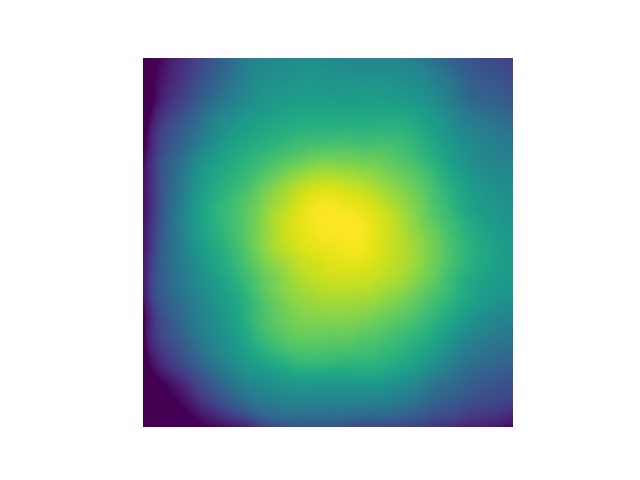
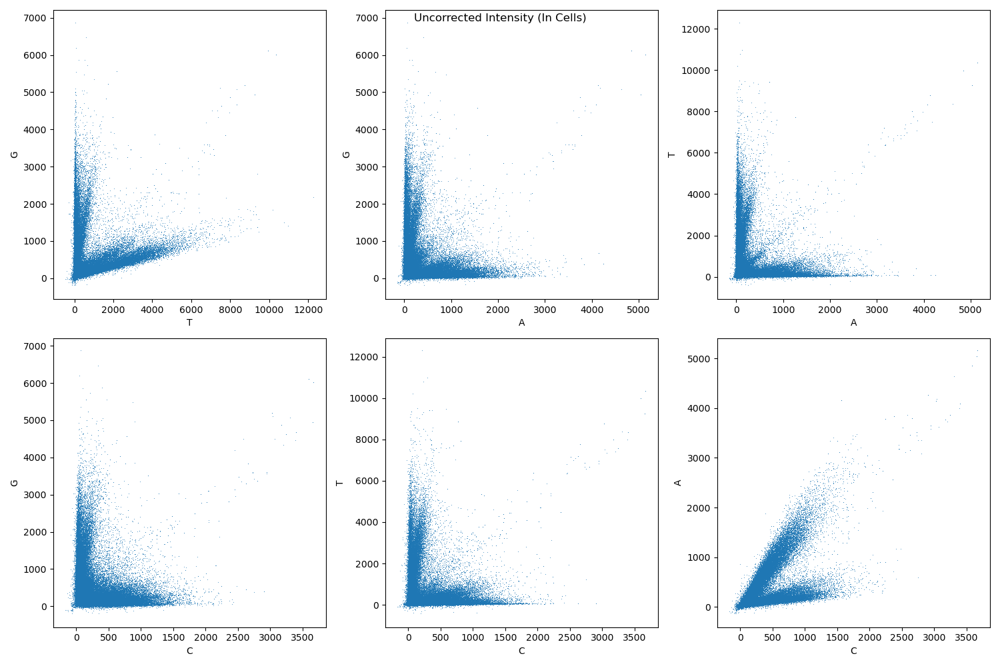
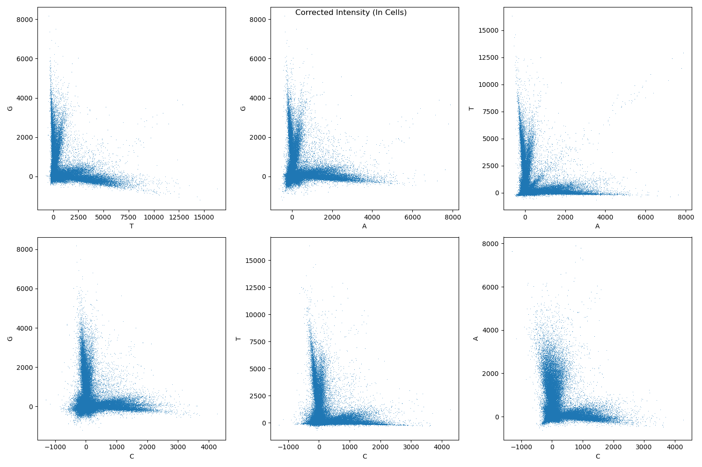

*********************
Command Line Examples
*********************

Welcome to the command-line guide for Scallops. This documentation walks you through the complete image processing and
analysis pipeline, designed specifically for large-scale optical pooled screens (OPS).

The Scallops pipeline takes you from raw, uncorrected microscope image tiles to fully registered, segmented datasets,
feature extraction, and downstream statistical analysis.

.. note:: A complete notebook tutorial with real data is also available to help you walk through this pipeline step-by-step on the `periscope data <https://github.com/broadinstitute/2022_PERISCOPE>`_.

Illumination Correction
========================
Illumination correction is computed separately for each well, cycle, and channel using all image tiles as
input. It is calculated by computing the mean (or median; see --agg-method option), followed by a median filter
(radius of the disk-shaped footprint is 1/20th area of image), and rescaling using 2nd percentile for a robust
minimum in the aggregation method. This method is equivalent to CellProfiler's CorrectIlluminationCalculate_
module with option "Regular", "All", "Median Filter". The algorithm was originally benchmarked using ~250 images per
plate to calculate plate-wise illumination correction functions `(Singh et al. J Microscopy, 2014)`_.

Example flat-field image:

Example::

   # illumination correction per cycle in well 3 of ISS data
   scallops illum-corr agg \
   --agg-method mean \
   --images "s3://xxx-input/" \
   --image-pattern "20231010_10x_6W_SBS_c{t}/plate{plate}/Well{well}_Point{skip}_{skip}_Channel{skip}_Seq{skip}.nd2" \
   --output "s3://xxx/stitch/iss/illumination_correction/" \
   --groupby plate well t \
   --subset "A-3-*"

   # illumination correction per cycle in well 3 of IF & FISH data
   scallops illum-corr agg \
   --agg-method mean \
   --images "s3://xxx-input/" \
   --image-pattern "{skip}_20x_6W_{t}/plate{plate}/Well{well}_Point{skip}_{skip}_Channel{skip}_Seq{skip}.nd2" \
   --output "s3://xxx/stitch/pheno/illumination_correction/" \
   --groupby plate well t \
   --subset "A-3-IF" "A-3-FISH"

Stitch
=======

Each well and cycle is stitched independently into an OME Zarr image. The stage positions are read directly from a
large number of file formats (including nd2). Illumination correction is applied by dividing the image intensity by the
flatfield image when writing the stitched image.

Example::

   scallops stitch \
   --images "s3://xxx-input/"\
   --image-pattern "20231010_10x_6W_SBS_c{t}/plate{plate}/Well{well}_Point{skip}_{skip}_Channel{skip}_Seq{skip}.nd2" \
   --ffp "s3://xxx/stitch/iss/illumination_correction/{plate}-{well}-{t}.ome.tiff" \
   --image-output "s3://xxx/stitch/iss/stitch/stitch.zarr" \
   --report-output "s3://xxx/stitch/iss/stitch/report" \
   --groupby plate well t \
   --subset "A-3-*"

   scallops stitch \
   --images "s3://xxx-input/" \
   --image-pattern "{skip}_20x_6W_{t}/plate{plate}/Well{well}_Point{skip}_{skip}_Channel{skip}_Seq{skip}.nd2" \
   --ffp "s3://xxx/stitch/pheno/illumination_correction/{plate}-{well}-{t}.ome.tiff" \
   --image-output "s3://xxx/stitch/pheno/stitch/stitch.zarr"  \
   --report-output "s3://xxx/stitch/pheno/stitch/report"  \
   --groupby plate well t \
   --subset "A-3-IF" "A-3-FISH"

Register ISS Images
=====================

Register ISS images to first cycle.

Example::

    scallops registration elastix \
    --groupby plate well \
    --moving-image-pattern '{plate}-{well}-{t}' \
    --moving-output s3://xxx/ops/iss-registered-t0.zarr \
    --moving s3://xxx/stitch/iss/stitch/stitch.zarr/ \
    --transform-output s3://xxx/ops/iss-transforms-t0 \
    --subset A-3

Register Phenotype Images
=========================

Create a single image stack registered to the IF DAPI channel. The `unroll-channels`
option stacks all the phenotypic channels into the c dimension of the resulting image. The `time` option
selects the reference round to align to. Note that the order of cycles is preserved (FISH, IF), hence
the registered image has the FISH channels followed by the IF channels.

Example::

    scallops registration elastix -\
    -groupby plate well \
    --moving-image-pattern '{plate}-{well}-{t}' \
    --moving-output s3://xxx/ops/pheno-registered.zarr \
    --moving s3://xxx/stitch/pheno/stitch/stitch.zarr/ \
    --moving-label s3://xxx/stitch/pheno/stitch/stitch.zarr/ \
    --transform-output s3://xxx/ops/pheno-to-pheno-transforms \
    --subset A-3 \
    --label-output s3://xxx/ops/pheno-registered.zarr \
    --unroll-channels \
    --time IF

Segmentation
============

Segment the phenotype images. Note that there is a one-to-one correspondence between nuclei and cell labels when using
the watershed or propagation algorithms for cell segmentation. Cytosol labels are computed by
taking the difference between cell and nuclei labels.

Nuclei::

    scallops segment nuclei \
    --images s3://xxx/ops/pheno-registered.zarr \
    --groupby plate well \
    --image-pattern '{plate}-{well}' \
    --dapi-channel 4 \
    --output s3://xxx/ops/segment.zarr \
    --subset A-3

Cells::

    scallops segment cell \
    --images s3://xxx/ops/pheno-registered.zarr \
    --groupby plate well \
    --image-pattern '{plate}-{well}' \
    --cyto-channel 6 \
    --nuclei-label s3://xxx/ops/segment.zarr \
    --output s3://xxx/ops/segment.zarr \
    --subset A-3

Register Phenotype to ISS & Transfer Segmentation Labels
========================================================

Register the phenotype image to the ISS image and transfer the segmentation labels
from phenotype image coordinates to ISS coordinates. Also output the registered phenotype DAPI channel, which will be
used later for QC.

Example::

    scallops registration elastix \
    --groupby plate well \
    --moving-image-pattern '{plate}-{well}' \
    --moving-output s3://xxx/ops/pheno-to-iss-registered.zarr \
    --moving s3://xxx/ops/pheno-registered.zarr \
    --moving-label s3://xxx/ops/segment.zarr \
    --fixed s3://xxx/stitch/iss/stitch/stitch.zarr/ \
    --fixed-image-pattern '{plate}-{well}-{t}' \
    --transform-output s3://xxx/ops/pheno-to-iss-transforms \
    --subset A-3 \
    --label-output s3://xxx/ops/pheno-to-iss-registered.zarr \
    --output-aligned-channels-only

Spot Detection
===============

Find spots by taking standard deviation over cycles, followed by mean across channels or if only 1 cycle is
present, computing standard deviation across channels.

Example::

    scallops pooled-sbs spot-detect \
    --output s3://xxx/ops/spot-detect.zarr \
    --image-pattern '{plate}-{well}' \
    --images s3://xxx/ops/iss-registered-t0.zarr \
    --channel 1 2 3 4 \
    --groupby plate well \
    --subset A-3

Read calling
============
Assign bases at each cycle to the base with maximum intensity after correcting for channel crosstalk.

Example crosstalk before correction:

Example crosstalk after correction:

Example::

    scallops pooled-sbs reads \
    --spots s3://xxx/ops/spot-detect.zarr \
    --labels s3://xxx/ops/pheno-to-iss-registered.zarr \
    --label-name cell \
    --output s3://xxx/ops/reads \
    --subset A-3 \
    --barcodes s3://xxx/barcodes/dialout-5.csv

Find objects
==================
Find objects in a labeled array (output from segmentation).

Nuclei::

    scallops find-objects \
    --labels s3://xxx/ops/segment.zarr \
    --subset A-3 \
    --label-pattern {plate}-{well} \
    --label-suffix nuclei \
    --output s3://xxx/ops/objects-nuclei

Cells::

    scallops find-objects \
    --labels s3://xxx/ops/segment.zarr \
    --subset A-3 \
    --label-pattern {plate}-{well} \
    --label-suffix cell \
    --output s3://xxx/ops/objects-cell\

Cytosol::

    scallops find-objects \
    --labels s3://xxx/ops/segment.zarr \
    --subset A-3 \
    --label-pattern {plate}-{well} \
    --label-suffix cytosol \
    --output s3://xxx/ops/objects-cytosol

Features
==================
Compute phenotype features.

Nuclei::

    scallops features \
    --features-nuclei intensity_* \
    --labels s3://xxx/ops/segment.zarr \
    --groupby plate well \
    --subset A-3 \
    --output s3://xxx/ops/features-nuclei \
    --images s3://xxx/ops/pheno-registered.zarr \
    --objects s3://xxx/ops/objects-nuclei \
    --image-pattern '{plate}-{well}'

Cells::

    scallops features \
    --features-cell intensity_* \
    --labels s3://xxx/ops/segment.zarr \
    --groupby plate well \
    --subset A-3 \
    --output s3://xxx/ops/features-cell \
    --images s3://xxx/ops/pheno-registered.zarr \
    --objects s3://xxx/ops/objects-cell \
    --image-pattern '{plate}-{well}'

Cytosol::

    scallops features \
    --features-cytosol intensity_* \
    --labels s3://xxx/ops/segment.zarr \
    --groupby plate well \
    --subset A-3 \
    --output s3://xxx/ops/features-cytosol \
    --images s3://xxx/ops/pheno-registered.zarr \
    --objects s3://xxx/ops/objects-cytosol \
    --image-pattern '{plate}-{well}'

Mark Cells That Intersect Stitching Boundary
============================================

IF (Reference Phenotype used for registration)::

    scallops features \
    --features-cell intersects-boundary_0 \
    --labels s3://xxx/ops/segment.zarr \
    --groupby plate well \
    --subset A-3 \
    --output s3://xxx/ops/intersects-boundary \
    --images s3://xxx/stitch/pheno/stitch/stitch.zarr/labels/ \
    --objects s3://xxx/ops/objects-cell \
    --image-pattern '{plate}-{well}-IF-mask'

FISH::

    scallops features \
    --features-cell intersects-boundary_0 \
    --labels s3://xxx/ops/segment.zarr \
    --groupby plate well \
    --subset A-3 \
    --output s3://xxx/ops/intersects-boundary-t \
    --images s3://xxx/ops/pheno-registered.zarr/labels/ \
    --objects s3://xxx/ops/objects-cell \
    --image-pattern '{plate}-{well}-{t}-mask'

Registration QC
==============================
Find objects in ISS image::

    scallops find-objects \
    --labels s3://xxx/ops/pheno-to-iss-registered.zarr \
    --subset A-3 \
    --label-pattern {plate}-{well} \
    --label-suffix nuclei \
    --output s3://xxx/ops/objects-nuclei-iss

Compute correlation in nuclei bounding boxes between ISS DAPI channel and registered IF DAPI channel::

    scallops features \
    --features-nuclei correlationpearsonbox_0_s0 \
    --labels s3://xxx/ops/pheno-to-iss-registered.zarr \
    --objects s3://xxx/ops/objects-nuclei-iss \
    --groupby plate well \
    --subset A-3 \
    --output s3://xxx/ops/pheno-to-iss-qc \
    --images s3://xxx/ops/iss-registered-t0.zarr \
    --stack-images s3://xxx/ops/pheno-to-iss-registered.zarr \
    --image-pattern '{plate}-{well}' \
    --stack-image-pattern '{plate}-{well}' \
    --channel-rename '{"0":"ISS","s0":"PHENO"}'

Compute correlation in nuclei bounding boxes between ISS DAPI channel at t=0 and other times::

    scallops features \
    --features-nuclei correlationpearsonbox_0_0:35:5 \
    --labels s3://xxx/ops/pheno-to-iss-registered.zarr \
    --objects s3://xxx/ops/objects-nuclei-iss \
    --groupby plate well \
    --subset A-3 \
    --output s3://xxx/ops/iss-to-iss-qc \
    --images s3://xxx/ops/iss-registered-t0.zarr \
    --image-pattern '{plate}-{well}'

Compute correlation in nuclei bounding boxes between IF DAPI channel and FISH DAPI channel::

    scallops features \
    --features-nuclei correlationpearsonbox_0_4 \
    --labels s3://xxx/ops/segment.zarr \
    --objects s3://xxx/ops/objects-nuclei \
    --groupby plate well \
    --subset A-3 \
    --output s3://xxx/ops/pheno-to-pheno-qc \
    --images s3://xxx/ops/pheno-registered.zarr \
    --image-pattern '{plate}-{well}' \
    --channel-rename '{"0":"FISH","4":"IF"}'

Merge
======
Merge the phenotype features, ISS barcode assignments, and QC info.

Example::

    scallops pooled-sbs merge \
    --sbs s3://xxx/ops/reads/labels \
    --output s3://xxx/ops/merge \
    --barcodes s3://bigdipir-ctg-s3/internal/singa166-lab/barcodes/dialout-5.csv \
    --phenotype s3://xxx/ops/objects-nuclei \
    s3://xxx/ops/objects-cell \
    s3://xxx/ops/objects-cytosol \
    s3://xxx/ops/features-nuclei \
    s3://xxx/ops/features-cell \
    s3://xxx/ops/features-cytosol \
    s3://xxx/ops/intersects-boundary \
    s3://xxx/ops/intersects-boundary-t \
    s3://xxx/ops/pheno-to-iss-qc \
    s3://xxx/ops/iss-to-iss-qc \
    s3://xxx/ops/pheno-to-pheno-qc \
    --subset A-3

Rank Features
===============
Example::

    scallops rank-features \
    --input s3://xxx/ops/merge/A-3.parquet \
    --reference "NTC" \
    --features Nuclei_Intensity_MedianIntensity_Channel5 \
    --label-filter "barcode_Q_mean_0/barcode_Q_mean==1 & \
    Nuclei_Correlation_PearsonBox_ISS_PHENO>0.9 & \
    Nuclei_Correlation_PearsonBox_FISH_IF>0.9 & \
    ~Cells_Location_IntersectsBoundary_Channel0==False & \
    ~Cells_Location_IntersectsBoundary_Channel0_intersects_boundary_t==False" \
    --output s3://xxx/ops/rank-features/A-3.parquet

Volcano Plot:

.. code-block:: python

    import pandas as pd
    from adjustText import adjust_text
    from matplotlib import pyplot as plt
    import seaborn as sns
    import numpy as np

    rank_features_df = pd.read_parquet('s3://xxx/ops/rank-features/A-3.parquet')
    feature = 'Nuclei_Intensity_MedianIntensity_Channel5'
    fig, ax = plt.subplots()
    ax.set_title(feature)
    df = rank_features_df.query(f"feature=='{feature}'")
    df["-log10FDR"] = np.minimum(10, -np.log10(df["FDR"]))
    highlight_df = df.query("abs(fold_change)>2 & FDR<0.05")
    sns.scatterplot(df, x="fold_change", y="-log10FDR", ax=ax)
    texts = [
        ax.text(
            x=r["fold_change"],
            y=r["-log10FDR"],
            s=r["perturbation"],
        )
        for i, r in highlight_df.iterrows()
    ]
    adjust_text(
        texts,
        arrowprops=dict(arrowstyle="->", color="Grey"),
        ax=ax,
        x=highlight_df["fold_change"],
        y=highlight_df["-log10FDR"],
        expand_axes=True
    );

Perturbation Map Building
=========================

The ``scallops map`` subcommands build a perturbation map from the merged single-cell
feature table produced by ``scallops pooled-sbs merge``.  Every step reads an
**AnnData Zarr** (``.zarr``) file as input and writes an **AnnData Zarr** as
output, so each step can be run independently or chained inside a WDL workflow.
See :doc:`map_build` for the pipeline overview and backprojection guide.

.. note::

   All file paths shown below use local paths for clarity.  Cloud paths
   (``s3://``, ``gs://``, ``az://``) are equally supported via ``fsspec``.

Step 1 – Filter cells and features
------------------------------------

Remove cells with too many missing values, low/high-variance features, and
optionally: zero-inflated features, binary/categorical columns, features
correlated with batch identity, and highly redundant (correlated) features.

Minimal (variance + finite-value only)::

    scallops map filter \
        --input merged.zarr \
        --output filtered.zarr \
        --by plate well \
        --min-variance 0.1 \
        --max-variance 5.0 \
        --max-fraction-not-finite 0.25

With all optional filters enabled::

    scallops map filter \
        --input merged.zarr \
        --output filtered.zarr \
        --by plate well \
        --min-variance 0.1 \
        --max-variance 5.0 \
        --max-fraction-not-finite 0.25 \
        \
        --max-zero-fraction 0.5 \
        --near-zero-threshold 0.0 \
        \
        --min-unique 20 \
        \
        --batch-column plate \
        --batch-reference "gene_symbol=='NTC'" \
        --batch-pvalue 0.05 \
        --batch-method kruskal \
        \
        --max-correlation 0.9 \
        --correlation-reference "gene_symbol=='NTC'" \
        --correlation-chunk-size 512

Filtering a specific feature subset with a cell-level quality filter::

    scallops map filter \
        --input merged.zarr \
        --output filtered.zarr \
        --features Cells_Intensity Nuclei_AreaShape Cytoplasm_Texture \
        --label-filter "barcode_Q_mean_0 / barcode_Q_mean > 0.5" \
        --min-variance 0.1 \
        --max-fraction-not-finite 0.25

Step 2 – Yeo-Johnson transform (optional)
------------------------------------------

Apply a Yeo-Johnson power transform to reduce feature skewness before scaling.

Per-well transform (recommended)::

    scallops map transform-yj \
        --input filtered.zarr \
        --output yj.zarr \
        --by plate well

Global transform::

    scallops map transform-yj \
        --input filtered.zarr \
        --output yj.zarr

Step 3 – Well-level z-score
----------------------------

Normalise each feature to zero mean and unit variance within each well/plate
using the existing ``norm-features`` command.

All cells as reference (standard z-score)::

    scallops norm-features \
        --input yj.zarr \
        --output scaled.zarr \
        --by plate well \
        --method zscore

NTC controls as reference (recommended)::

    scallops norm-features \
        --input yj.zarr \
        --output scaled.zarr \
        --by plate well \
        --reference "gene_symbol=='NTC'" \
        --method zscore \
        --no-scaling

Robust statistics (median / MAD instead of mean / std)::

    scallops norm-features \
        --input yj.zarr \
        --output scaled.zarr \
        --by plate well \
        --reference "gene_symbol=='NTC'" \
        --robust

Step 4a – PCA embedding (runs BEFORE TVN — critical for memory)
----------------------------------------------------------------

``map pca`` reduces the data from **N × p features** to **N × K PCs**
(e.g. 10M × 5 000 → 10M × 128).  This dimensionality reduction is what makes
the subsequent ``map tvn`` step manageable in memory.  Without it, ``map tvn``
would need to materialise the full N × p matrix (~200 GB for 10M × 5K).
With it, ``map tvn`` sees only N × K (~5 GB for 10M × 128).

**Memory cost of this step:**

- *Fit* (incremental PCA on NTC batches): ``--batch-size × p × 8 B``
  = 200K × 5K × 8 = **8 GB** per batch.
- *Transform* (project all N cells, done in chunks): peak =
  ``(batch × p × 4 B)`` + ``(N × K × 4 B)``
  = 4 GB chunk + 5.1 GB output = **~9 GB**.

Fit on NTC reference cells, project all cells (recommended — matches gould pipeline)::

    scallops map pca \
        --input scaled.zarr \
        --output pca.zarr \
        --reference-query "gene_symbol=='NTC'" \
        --components 128 \
        --batch-size 200000

Fit on all cells (traditional PCA, no reference subset)::

    scallops map pca \
        --input scaled.zarr \
        --output pca.zarr \
        --components 128 \
        --batch-size 200000

Alternative column / reference value::

    scallops map pca \
        --input scaled.zarr \
        --output pca.zarr \
        --reference-query "perturbation_class=='scramble'" \
        --components 128

With PCA whitening::

    scallops map pca \
        --input scaled.zarr \
        --output pca.zarr \
        --reference-query "gene_symbol=='NTC'" \
        --components 128 \
        --whiten

Step 4b – Select significant PCA components
--------------------------------------------

After ``map pca``, retain only statistically informative components.
The **variance** method is recommended for morphological profiling because
the Tracy-Widom test assumes uncorrelated features, which is violated by
correlated CellProfiler compartment features.

Cumulative variance fraction (recommended for morphological data)::

    scallops map pca-select \
        --input pca.zarr \
        --output pca_selected.zarr \
        --method variance \
        --min-variance-fraction 0.95

Non-parametric permutation null (slower, accounts for non-Gaussian marginals)::

    scallops map pca-select \
        --input pca.zarr \
        --output pca_selected.zarr \
        --method permutation \
        --pval 0.05 \
        --n-perms 100

Tracy-Widom test with hard cap (legacy / reference pipeline compatibility)::

    scallops map pca-select \
        --input pca.zarr \
        --output pca_selected.zarr \
        --method tracy_widom \
        --pval 0.05 \
        --max-components 128

.. warning::

   ``--method tracy_widom`` assumes i.i.d. Gaussian entries under the null.
   For Cell Painting / morphological profiling data, correlated compartment
   features inflate all eigenvalues above the Tracy-Widom threshold, causing
   the test to retain every component.  Use ``--method variance`` or
   ``--method permutation`` instead.

Step 4c – Sphering / whitening (optional, pre-TVN)
----------------------------------------------------

Decorrelate features so the sample covariance approximates the identity.
Typically used between ``map pca`` and ``map tvn``::

    scallops map sphere \
        --input pca_selected.zarr \
        --output sphered.zarr \
        --epsilon 1e-5

Per-condition sphering::

    scallops map sphere \
        --input pca_selected.zarr \
        --output sphered.zarr \
        --by condition \
        --epsilon 1e-5

Step 5 – Typical Variation Normalization (TVN)
-----------------------------------------------

Apply TVN to remove systematic cell-to-cell variation measured in the NTC
controls.  Stores all parameters needed for downstream backprojection in
``uns`` and ``varm`` of the output **AnnData Zarr**.

.. important::

   **Input is N × K PCs, not N × p features.**
   ``map tvn`` reads the output of ``map pca`` (or ``map sphere``), whose shape
   is already ``N × K`` (e.g. 10M × 128).  This is why TVN is memory-efficient
   at scale (~5 GB for 10M cells at 128 PCs, not ~200 GB for raw features).
   Do **not** feed ``map tvn`` directly with the raw or scaled feature data
   — always run ``map pca`` first.

Basic (no per-plate covariance alignment).  Input is the PCA-reduced zarr::

    scallops map tvn \
        --input pca_selected.zarr \
        --output tvn.zarr \
        --reference-query "gene_symbol=='NTC'"

With per-plate covariance alignment (recommended for multi-plate experiments)::

    scallops map tvn \
        --input pca_selected.zarr \
        --output tvn.zarr \
        --reference-query "gene_symbol=='NTC'" \
        --by plate

Alternative reference selector (custom column and value)::

    scallops map tvn \
        --input pca_selected.zarr \
        --output tvn.zarr \
        --reference-query "perturbation_class=='scramble'" \
        --by plate

Step 6 – Aggregate to perturbation profiles
--------------------------------------------

Collapse single-cell profiles to one profile per perturbation (or per
perturbation × plate × well).

Simple gene-level mean::

    scallops map agg \
        --input tvn.zarr \
        --output agg.zarr \
        --by gene_symbol \
        --method mean

Per-plate mean profiles (retain plate information for downstream analysis)::

    scallops map agg \
        --input tvn.zarr \
        --output agg.zarr \
        --by plate well gene_symbol \
        --method mean

Require at least 10 cells per perturbation::

    scallops map agg \
        --input tvn.zarr \
        --output agg.zarr \
        --by gene_symbol \
        --perturbation gene_symbol \
        --min-cells 10 \
        --method mean

Two-step barcode → gene aggregation (median of means)::

    scallops map agg \
        --input tvn.zarr \
        --output agg.zarr \
        --by gene_symbol \
        --barcode barcode_0 \
        --agg-by-barcode \
        --method mean

Step 7 – Center profiles (optional)
--------------------------------------

Subtract the mean of the NTC controls before computing the similarity matrix.
After centering the NTC profiles become the zero vector, so they should be
excluded from ``map similarity`` using ``--exclude-reference``.

Center on NTC mean::

    scallops map center \
        --input agg.zarr \
        --output centered.zarr \
        --reference "gene_symbol=='NTC'"

Robust centering (subtract NTC median)::

    scallops map center \
        --input agg.zarr \
        --output centered.zarr \
        --reference "gene_symbol=='NTC' or gene_symbol.str.startswith('OR')" \
        --robust

Per-condition centering::

    scallops map center \
        --input agg.zarr \
        --output centered.zarr \
        --reference "gene_symbol=='NTC'" \
        --by condition

Step 8 – Pairwise similarity matrix
-------------------------------------

Compute the ``(n_perturbations × n_perturbations)`` cosine or Pearson
similarity matrix.  The output is an **AnnData Zarr** where both ``obs`` and
``var`` are indexed by perturbation label and ``X`` contains the similarities.

Cosine similarity, exclude NTC (zero vector after centering)::

    scallops map similarity \
        --input centered.zarr \
        --output similarity.zarr \
        --metric cosine \
        --perturbation gene_symbol \
        --exclude-reference "gene_symbol=='NTC'"

Pearson correlation, all profiles::

    scallops map similarity \
        --input agg.zarr \
        --output similarity.zarr \
        --metric pearson \
        --perturbation gene_symbol

Step 9 – Recall benchmarks
----------------------------

Evaluate the similarity matrix against one or more reference databases.
Multiple sources can be combined in a single call; each produces its own rows
in the output Parquet with ``source`` and ``method`` columns.

CORUM protein complexes (set-based KS test)::

    scallops map recall \
        --input similarity.zarr \
        --output recall.parquet \
        --corum data/corum_humanComplexes.txt \
                data/corum_humanComplexes-filtered.txt \
        --min-genes 5

MSigDB / Reactome / KEGG / GO gene sets via GMT (set-based KS test)::

    scallops map recall \
        --input similarity.zarr \
        --output recall.parquet \
        --gmt data/h.all.v2023.2.Hs.symbols.gmt \
              data/c2.cp.reactome.v2023.2.Hs.symbols.gmt \
        --min-genes 5

STRING protein–protein interactions (pairwise recall)::

    # From a pre-downloaded TSV (preferredName_A, preferredName_B, score columns)
    scallops map recall \
        --input similarity.zarr \
        --output recall.parquet \
        --string data/9606.protein.links.symbols.txt \
        --string-threshold 700 \
        --min-pairs 10

STRING via REST API (queries at run time, requires internet)::

    scallops map recall \
        --input similarity.zarr \
        --output recall.parquet \
        --string-fetch \
        --string-threshold 400 \
        --string-species 9606 \
        --string-network-type physical

Reactome Functional Interactions (pairwise recall)::

    scallops map recall \
        --input similarity.zarr \
        --output recall.parquet \
        --reactome data/FIsInGene_020720_with_annotations.txt \
        --min-pairs 10

All sources combined in one run::

    scallops map recall \
        --input similarity.zarr \
        --output recall.parquet \
        --corum data/corum_humanComplexes.txt \
        --gmt data/h.all.v2023.2.Hs.symbols.gmt \
        --string data/9606.protein.links.symbols.txt \
              --string-threshold 700 \
        --reactome data/FIsInGene_020720_with_annotations.txt \
        --min-genes 5 \
        --min-pairs 10

Reading the recall results
^^^^^^^^^^^^^^^^^^^^^^^^^^^

.. code-block:: python

    import pandas as pd

    df = pd.read_parquet("recall.parquet")
    print(df.columns.tolist())
    # ['source', 'method', 'name', 'size', 'within_mean', 'between_mean',
    #  'statistic', 'pvalue']          ← set_benchmark rows (CORUM / GMT)
    # ['source', 'method', 'n_pairs', 'threshold', 'recall']
    #                                   ← pairwise_recall rows (STRING / Reactome FI)

    # Filter to the two-sided 5 % recall from CORUM
    corum_recall = df.query(
        "source == 'corum_humanComplexes.txt' and method == 'set_benchmark'"
    )

    # Overall recall at 5 % threshold from STRING
    string_df = df.query("method == 'pairwise_recall' and source.str.startswith('STRING')")
    print(string_df)

Backprojection
--------------

After TVN, use :func:`~scallops.features.backprojection.top_features_from_backprojection`
to find which original z-score features best explain a cluster or perturbation
group.  The function reads the backprojection parameters stored in the
**AnnData Zarr** output of ``map tvn`` (propagated by all downstream steps).

.. code-block:: python

    from scallops.io import read_anndata_zarr
    from scallops.features.backprojection import (
        backproject_tvn,
        top_features_from_backprojection,
    )

    # Works on any step that preserved uns (tvn.zarr, agg.zarr, similarity.zarr, …)
    data = read_anndata_zarr("tvn.zarr")

    # Top-20 features separating gene_A from all other perturbations
    result = top_features_from_backprojection(
        data,
        genes=["gene_A"],
        top_k=20,
    )

    # gene_A vs gene_B specifically
    result = top_features_from_backprojection(
        data,
        genes=["gene_A"],
        genes_ref=["gene_B"],
        top_k=20,
    )

    # Cluster 2 vs clusters 0 and 1 (from UMAP / k-means)
    import numpy as np
    cluster_labels = np.array([...])   # one entry per obs, same order as data.obs
    result = top_features_from_backprojection(
        data,
        cluster_labels=cluster_labels,
        cluster_query=2,
        cluster_ref=[0, 1],
        top_k=20,
    )

    # With PC-level statistical filter (tests orthogonal PCs, not correlated features)
    result = top_features_from_backprojection(
        data,
        genes=["gene_A"],
        pc_stat_filter="ttest",
        pc_pvalue_threshold=0.05,
        top_k=20,
    )

    print(result.head())
    #       feature     score  pvalue
    # 0  Cells_Intensity_f3  0.412     NaN

.. _map-run-examples:

Running the full pipeline with ``map run``
=========================================

``scallops map run`` chains all steps into one command.  The key arguments
that differ from the individual step commands are described below.

``--tvn-by`` vs ``--by``
-------------------------

Individual ``map`` subcommands (``map tvn``, ``map filter``, ``map center``,
etc.) all expose a ``--by`` argument whose meaning is specific to that command.
In ``map run``, the consolidated pipeline only has *one* step that needs a
grouping column for its core computation: TVN covariance alignment.  To make
this explicit and avoid ambiguity, ``map run`` uses ``--tvn-by`` instead of
``--by``.

.. list-table::
   :header-rows: 1
   :widths: 35 65

   * - Invocation
     - Effect
   * - ``scallops map tvn --by plate``
     - Per-plate covariance alignment inside the individual ``map tvn`` step.
   * - ``scallops map run --tvn-by plate``
     - Same alignment, but expressed in the consolidated pipeline runner.
   * - ``scallops map run --tvn-by condition``
     - Per-condition alignment (requires a ``condition`` column in obs, either
       pre-existing or derived with ``--condition-column``/``--condition-map``).
   * - ``scallops map run`` *(no --tvn-by)*
     - Global TVN — one alignment matrix for all cells using all NTC cells.

Adding a derived condition column
----------------------------------

When your experimental condition is not stored as a column in the input data
(a common situation when conditions are encoded in well numbers), use
``--condition-column`` together with ``--condition-map``:

.. code-block:: bash

    scallops map run \
        --input s3://bucket/plate-A-well-1.parquet ... \
        --output-dir s3://bucket/analysis/ \
        --condition-column  condition \
        --condition-source-column  well \
        --condition-map  '{"1":"GIRED","2":"GIRED","3":"GIRED",
                           "4":"DMSO","5":"DMSO","6":"DMSO"}' \
        --tvn-by  condition \
        ...

If the condition column **already exists** in the input (e.g. the parquet was
pre-labelled), omit ``--condition-map`` and just name the column:

.. code-block:: bash

    scallops map run \
        --input s3://bucket/prelabelled.zarr \
        --output-dir s3://bucket/analysis/ \
        --condition-column  condition \
        --tvn-by  condition \
        ...

Scallops will verify the column is present and raise a clear error if it is
not.

Scale method: global vs local z-score
---------------------------------------

Both options normalise *within* each plate × well group.

``--scale-method global`` (default)
    Subtracts the per-feature well mean and divides by the per-feature well
    standard deviation, computed across **all cells in that well**.  Corrects
    well-to-well and plate-to-plate intensity shifts.

``--scale-method local``
    Spatial k-NN z-score: each cell is normalised relative to its *k* nearest
    neighbours in image space (same plate × well).  Corrects both the global
    well bias *and* local spatial gradients (e.g. illumination gradients,
    cell-density variation).  Requires centroid columns in obs.

.. code-block:: bash

    scallops map run \
        --input  s3://bucket/data/*.parquet \
        --output-dir  s3://bucket/analysis/ \
        --scale-method  local \
        --localz-neighbors  75 \
        --localz-centroid-y  Nuclei_AreaShape_Center_Y \
        --localz-centroid-x  Nuclei_AreaShape_Center_X \
        ...

Complete example (genome-wide screen, two conditions)
------------------------------------------------------

.. code-block:: bash

    scallops map run \
        --input \
            s3://bucket/A-1.parquet  s3://bucket/A-2.parquet  s3://bucket/A-3.parquet \
            s3://bucket/A-4.parquet  s3://bucket/A-5.parquet  s3://bucket/A-6.parquet \
            s3://bucket/B-1.parquet  s3://bucket/B-2.parquet  s3://bucket/B-3.parquet \
            s3://bucket/B-4.parquet  s3://bucket/B-5.parquet  s3://bucket/B-6.parquet \
        --output-dir  s3://bucket/analysis/ \
        \
        --label-filter  "barcode_count_0 / barcode_count > 0.5" \
        --min-variance  0.1 \
        --max-fraction-not-finite  0.25 \
        \
        --condition-column  condition \
        --condition-source-column  well \
        --condition-map  '{"1":"GIRED","2":"GIRED","3":"GIRED",
                           "4":"DMSO","5":"DMSO","6":"DMSO"}' \
        \
        --reference-query  "gene_symbol=='NTC'" \
        --perturbation  gene_symbol \
        --plate-column  plate \
        --well-column   well \
        --tvn-by  condition \
        \
        --scale-method  local \
        --localz-neighbors  75 \
        --localz-centroid-y  Nuclei_AreaShape_Center_Y \
        --localz-centroid-x  Nuclei_AreaShape_Center_X \
        \
        --pca-components  128 \
        --pca-batch-size  200000 \
        --pca-select-method  variance \
        --pca-variance-fraction  0.95 \
        \
        --agg-by  gene_symbol \
        --agg-method  mean \
        --min-cells  10 \
        \
        --metric  cosine \
        --cluster-method  hdbscan \
        --cluster-auto-params

.. _CorrectIlluminationCalculate: https://cellprofiler-manual.s3.amazonaws.com/CPmanual/CorrectIlluminationCalculate.html
.. _`(Singh et al. J Microscopy, 2014)`: https://www.ncbi.nlm.nih.gov/pmc/articles/PMC4359755/
